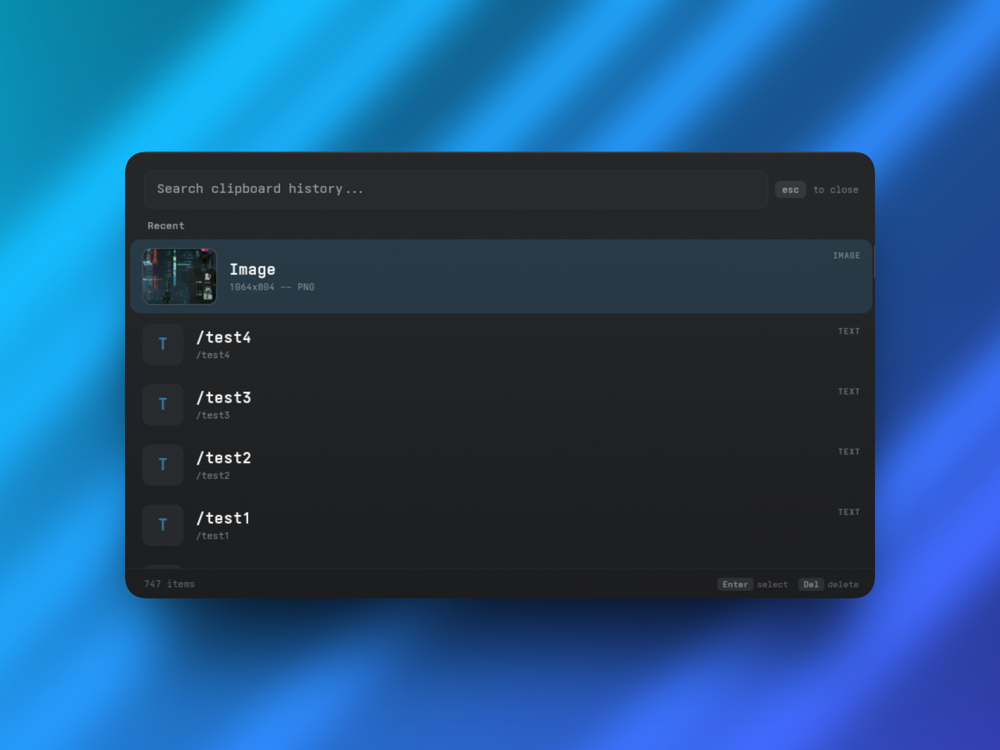

# cliphist-gui

A lightweight clipboard manager for Wayland, built with GTK4 and Layer Shell. Designed as a visual frontend for [cliphist](https://github.com/sentriz/cliphist) with image previews, fuzzy search, and full keyboard control.



## Purpose

I wanted a clipboard manager that:

- Shows image thumbnails alongside text entries
- Something that was light weight and performant and not hogging up too many resources.
- Has a clean, transparent UI but that can be styled to whatever and follow any design language.
- Doesn't pull in a full desktop framework just to list clipboard entries
- Wanted to learn Rust and how it works

I tried rofi and some other options but none were looking good or I wasn't able to style them how I wanted.

## Features

- Image thumbnail previews (generated using ImageMagick, cached in `~/.cache`)
- Live search filtering
- Configurable keybinds, window size, position, and behavior using a simple text config file
- External CSS theming with hot-reload ( which restarts the daemon)
- Daemon mode -- stays in memory, toggles instantly via keybind
- Layer Shell overlay with compositor blur support
- Detects content type (TEXT / IMAGE / URL) automatically
- Delete entries inline with `Delete` or with a custom keybind that can be set in config

## Dependencies

- [cliphist](https://github.com/sentriz/cliphist) -- clipboard history backend
- [wl-clipboard](https://github.com/bugaevc/wl-clipboard) -- `wl-copy` for writing to clipboard
- GTK4
- gtk4-layer-shell
- ImageMagick -- for thumbnail generation
- A Wayland compositor (I am building this on Arch and Hyprland)

### Arch Linux

```sh
pacman -S cliphist wl-clipboard gtk4 gtk4-layer-shell imagemagick
```

### Build dependencies

- Rust toolchain (`rustup` recommended)
- pkg-config
- GTK4 development headers (usually pulled in by the GTK4 package)

## Building

```sh
git clone https://github.com/vib1240n/cliphist-gui.git
cd cliphist-gui
cargo build --release
```

## Installation

```sh
cp target/release/cliphist-gui ~/.local/bin/
```

## Setup

You can generate a template config using this command:

```sh
cliphist-gui --generate-config
```

This creates `~/.config/cliphist-gui/` with:

- `config` -- window size, position, keybinds, behavior
- `style.css` -- full GTK4 CSS theme (edit to your liking)

### Hyprland

> Currently, I can't seem to figure out how to get this working with hyprland as exec cliphist-gui so I am using a simple script

```

#!/bin/bash
if pgrep -x cliphist-gui > /dev/null; then
    kill -USR1 $(pgrep -x cliphist-gui)
else
    cliphist-gui &
fi
```

For compositor blur, add layer rules:

```
layerrule = blur on, match:namespace cliphist-gui
layerrule = ignore_alpha 0, match:namespace cliphist-gui
```

Make sure `cliphist` is storing your clipboard history. Typically this goes in your Hyprland startup:

```
exec-once = wl-paste --watch cliphist store
```

### Other compositors

Should work on any Wayland compositor that supports `wlr-layer-shell`. The toggle mechanism uses PID files and Unix signals, so in theory should work anywhere

## Usage

```
cliphist-gui                    Launch daemon or toggle visibility
cliphist-gui --config           Show config directory and files
cliphist-gui --generate-config  Create config dir with defaults
cliphist-gui --reload           Reload config + CSS (restarts daemon)
cliphist-gui --help             Show help
```

`cliphist-gui` to turn on the daemon and then `cliphist-gui` to toggle visibility of the menu

## Default Configuration

### Default config

#### `~/.config/cliphist-gui/config`

```ini
[window]
width = 580
height = 520
anchor = center
# Options: center, top, top-left, top-right, bottom, bottom-left, bottom-right, cursor
margin_top = 0
margin_bottom = 0
margin_left = 0
margin_right = 0

[style]
theme = ~/.config/cliphist-gui/style.css

[behavior]
max_items = 0          # 0 = show all
close_on_select = true
notify_on_copy = false

[keybinds]
select = Return Enter
delete = Delete
clear_search = Ctrl+u
close = Escape
next = Down Tab
prev = Up Shift+Tab
page_down = Page_Down
page_up = Page_Up
first = Home
last = End
```

Multiple keys per action are space-separated. Modifiers use `+` notation: `Ctrl+u`, `Shift+Tab`, `Alt+d`.

### Default Styling

#### `~/.config/cliphist-gui/style.css`

Standard GTK4 CSS. The default theme uses translucent backgrounds for compositor blur. Key classes:

| Class                     | Element                     |
| ------------------------- | --------------------------- |
| `.clip-container`         | Main window background      |
| `.clip-search`            | Search input                |
| `.clip-list row`          | Clipboard entry rows        |
| `.clip-list row:selected` | Selected row                |
| `.clip-title`             | Entry title text            |
| `.clip-subtitle`          | Entry subtitle / metadata   |
| `.clip-badge`             | Type badge (TEXT/IMAGE/URL) |
| `.clip-text-icon`         | Text entry icon box         |
| `.clip-thumb-frame`       | Image thumbnail frame       |
| `.clip-status-bar`        | Bottom status bar           |

Edit the CSS and run `cliphist-gui --reload` to apply changes.

## Logs

Logs are written to `~/.local/state/cliphist-gui/cliphist-gui.log` with timestamps. If the log file gets bigger than 10MB, it creates a new log file.

## Project structure

```
src/
  main.rs          -- all application logic (~900 lines)
  style.css        -- default CSS (compiled into binary as fallback)
  config.default   -- default config (compiled into binary as fallback)
Cargo.toml
install.sh
```

## License

MIT
